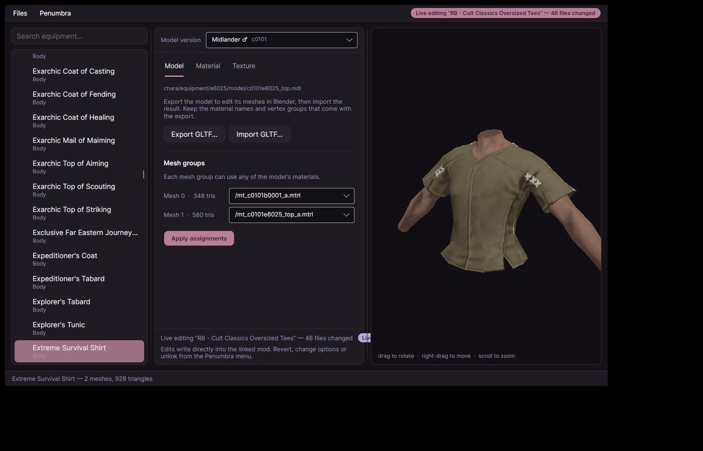

# Moonlace

A native, Linux-first desktop workbench for Final Fantasy XIV models and Penumbra mods.

Browse gear, accessories, character models, and body parts straight from the game files. Preview them fully textured in 3D, edit models and materials, swap textures, live-edit installed Penumbra mods, and upgrade older modpacks to Dawntrail formats.

Your actual FFXIV installation stays read-only the entire time.




## Features

* **Browse basically everything**
  Explore around 29,000 gear pieces and accessories, plus faces, hairstyles, tails, and body models. Everything is arranged in a searchable tree under Gear, Accessories, and Body.

* **Real 3D previews**
  Models are rendered with their actual textures, materials, color tables, and race or gender variants.

* **Edit without touching the game files**
  Export models as GLTF, edit them in Blender, then import them back into Moonlace. Recolor material tables, replace textures, and reassign materials per mesh while seeing the results live.

* **Live-edit Penumbra mods**
  Link an installed Penumbra mod and edit its files directly. Moonlace respects the mod's option structure and backs up every file before its first change, so the whole session can be reverted later.

* **Create Penumbra options**
  Add new option groups and options from inside Moonlace, then capture your edits into them. New options start empty, allowing the mod's existing files to remain active underneath.

* **Upgrade older mods to Dawntrail**
  Import an Endwalker-era `.pmp`, `.ttmp`, or `.ttmp2` and export an updated `.pmp`. Moonlace converts legacy materials, index textures, masks, and normals to the current game formats.

* **Export as PMP**
  Package the edits from your current session into a Penumbra mod with one click.

* **Editing sessions**
  Every launch starts a fresh session, so you always begin with a clean worktree. The Sessions menu shows exactly which files you have touched, reconnects you to any previous session, and can automatically clean up sessions you have not used for a day, a week, or a month.

* **FFXIV stays pristine**
  Moonlace treats the game installation as strictly read-only. Normal edits live in Moonlace sessions. Live Penumbra edits only touch the mod folder you explicitly linked.

## Download and run

Grab the build for your platform from the latest release. Every variant keeps itself up to date: when a new version is published, an **Update** button appears in the top bar and one click installs it and restarts Moonlace.

### Linux

Download:

```text
Moonlace.AppImage
```

Then:

```sh
chmod +x Moonlace.AppImage
./Moonlace.AppImage
```

The AppImage updates itself in place.

### Windows

Pick one:

```text
Moonlace-win-Setup.exe      installer with shortcuts
Moonlace-win-Portable.zip   no install, run from anywhere
```

Run the installer, or extract the portable zip and run `Moonlace.exe`. Both update themselves.

The release builds are self-contained, so there is no separate .NET runtime to install.

Linux only needs a working OpenGL driver. Both X11 and Wayland are supported.

## First run

On first launch, Moonlace asks where FFXIV is installed.

You can point it at any of these:

* the FFXIV installation root
* the `game` directory
* the `sqpack` directory

Moonlace validates the path and remembers it for next time.

A typical Steam or Proton installation might look like:

```text
…/steamapps/common/FINAL FANTASY XIV Online/game
```

## Quick tour

### Browsing

The left panel contains three main sections:

* **Gear**
* **Accessories**
* **Body**

Body includes things such as faces, hairstyles, tails, and body models.

Expand a category manually or type into the search box to filter the entire tree. Search results remain grouped under their original categories.

Select an item and its model appears in the viewport, with the available editing tools shown alongside it.

If the item has multiple race or gender variants, use the **Model version** dropdown to switch between them.

### Viewport controls

* Drag to rotate
* Right-drag to pan
* Scroll to zoom

Tiny digital dress-up doll controls. Very serious software.

### Model editing

The **Model** tab lets you export and import GLTF files for Blender round-tripping.

Bone weights are included, and imported models can be previewed immediately.

You can also reassign meshes to any material available on the model.

### Material editing

The **Material** tab exposes the model's material data and color tables.

You can edit values such as:

* diffuse color
* specular color
* emissive color
* gloss

Texture slots can also be redirected to different textures.

### Texture editing

The **Texture** tab lets you preview, export, and replace textures.

Textures export as PNG.

Imports support:

```text
PNG
JPG
TGA
BMP
```

### Edit sessions

Normal edits are stored per item and persist across restarts.

Use **Discard changes** to throw away the session and return to the untouched game assets.

Use **Export PMP...** to package the current edits into a Penumbra mod.

## Penumbra live editing

Open:

```text
Penumbra → Live edit...
```

Then select an installed Penumbra mod folder.

Moonlace loads the mod's option structure and lets you choose which options should be active while editing.

From there, edit the model, materials, or textures normally.

The difference is that changes are written directly into the linked mod folder. Redraw the character in Penumbra and the results can be checked in game immediately.

Before Moonlace changes a file for the first time, the original is copied into:

```text
.moonlace-backup/
```

These backups survive restarts.

Use **Revert changes** to restore the original files from the current live-edit session.

### Creating new mod options

Use:

```text
New option or group...
```

to add new Penumbra option groups or options.

New options begin empty. Existing mod files continue to provide their defaults underneath them.

Edits made while the new option is active can then be captured into that option, after which Penumbra can toggle it normally.

## Upgrading mods to Dawntrail

Open:

```text
Files → Upgrade to DT...
```

Moonlace accepts:

```text
.pmp
.ttmp
.ttmp2
```

and writes a new upgraded `.pmp` next to the original file.

The source modpack is never modified.

During conversion, Moonlace can update:

* pre-Dawntrail material formats
* index textures
* mask channels
* normal channels

It also works as a straightforward TTMP to PMP converter when the source pack already uses current formats.

One limitation: `.meta` and `.rgsp` metadata entries are not carried over. If a mod depends on them, import the original mod alongside the converted version.

## Data locations

| What              | Linux                                     | Windows                                   |
| ----------------- | ----------------------------------------- | ----------------------------------------- |
| Settings          | `~/.config/Moonlace/`                     | `%APPDATA%\Moonlace\`                     |
| Edit sessions     | `~/.local/share/Moonlace/sessions/`       | `%LOCALAPPDATA%\Moonlace\sessions\`       |
| Live-edit backups | `.moonlace-backup/` inside the linked mod | `.moonlace-backup/` inside the linked mod |

## Building from source

Moonlace requires the .NET 10 SDK when building from source.

Run the application:

```sh
dotnet run --project src/Moonlace.App
```

Run the tests:

```sh
dotnet test
```

Build release packages into `dist/releases/` (requires the Velopack CLI, `dotnet tool install -g vpk`):

```sh
scripts/build-release.sh
```

## A small but important promise

Moonlace does not modify your FFXIV installation.

Game assets are treated as source material only. Your experiments stay in Moonlace sessions or inside Penumbra mods you deliberately chose to edit.

Break the model, make the texture radioactive pink, give a Lalafell a deeply questionable material setup, then discard the session and carry on. The game files remain blissfully unaware.
